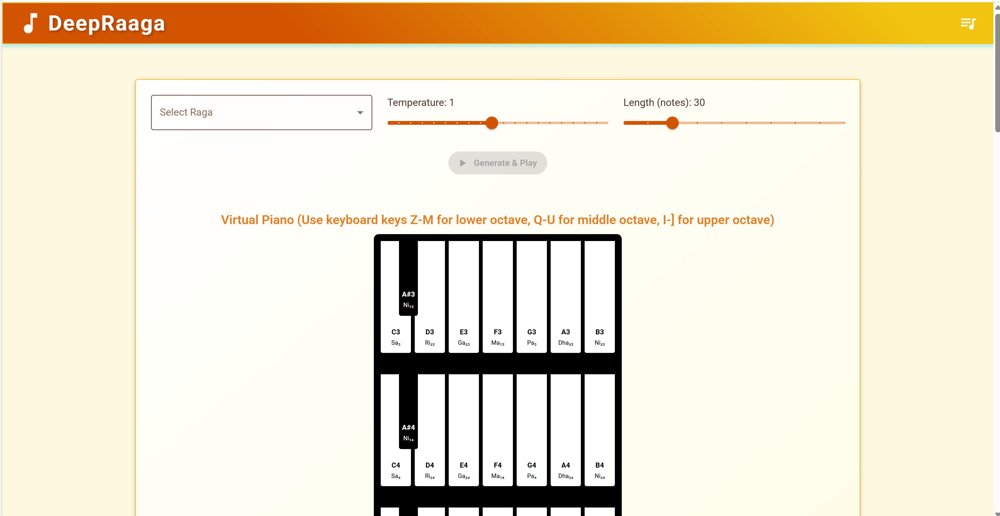

<div align="center">

# 🎵 naada

**The Cosmic Sound of Carnatic AI**

*naada (नाद) — Sanskrit for the primordial vibration from which all music descends*



[](https://pypi.org/project/deepraaga-core/)
[](https://pypi.org/project/deepraaga-preprocess/)
[](https://pypi.org/project/deepraaga-models/)
[](https://pypi.org/project/deepraaga-api/)
[](https://www.python.org/downloads/)
[](https://reactjs.org/)
[](https://pytorch.org/)
[](https://github.com/sgmoorthy/naada/actions)
[](https://github.com/sgmoorthy/naada/actions)
[](https://github.com/sgmoorthy/naada/actions)
[](https://opensource.org/licenses/MIT)

*naada is an open-source AI framework dedicated to modeling the intricate structural beauty of Carnatic music using deep learning. By harmonizing traditional heritage with modern ML paradigms, we strive to build a computational bridge to India's rich musical legacy.*

[**Live Demo →**](https://sgmoorthy.github.io/naada/) | [**PyPI Packages →**](https://pypi.org/search/?q=deepraaga) | [**Tutorial →**](examples/DeepRaaga_Tutorial.ipynb) | [**Blog →**](https://sgmoorthy.github.io/naada/#/blog)

</div>

---

## 🌟 Vision: A National Knowledge Repository

Inspired by the visionary dialogue between PM Narendra Modi and veteran composer Ramesh Vinayakam on creating a *"National Knowledge Repository"* for Indian music, naada stands as a foundational step toward that goal.

Carnatic music cannot be reduced to simple discrete notes — it is defined by the continuous, microtonal inflections (**Gamakas**), characteristic melodic pathways (**Sancharas**), and the strict grammatical constraints of ascending (**Arohana**) and descending (**Avarohana**) scales. Our mission is to encode this profound acoustic heritage into robust AI models, moving beyond Western-centric MIR to create an open platform that respects, preserves, and innovates upon the grammar of Indian Classical Music.

---

## 🏗️ Architecture

naada is now organized as a **modular Python monorepo** with 4 PyPI packages:

### � PyPI Packages

| Package | Install | Purpose | Dependencies |
|---------|---------|---------|--------------|
| `deepraaga-core` | `pip install deepraaga-core` | Base domain models and abstractions | None |
| `deepraaga-preprocess` | `pip install deepraaga-preprocess` | MIDI/MusicXML ingestion, vocabulary builders | `deepraaga-core`, `music21`, `librosa` |
| `deepraaga-models` | `pip install deepraaga-models` | LSTM + Attention architectures, training | `deepraaga-core`, `torch` |
| `deepraaga-api` | `pip install deepraaga-api` | Flask REST service | `deepraaga-core`, `flask` |

**Install all packages:**
```bash
pip install deepraaga-core deepraaga-preprocess deepraaga-models deepraaga-api
```

### ⚛️ Interaction Layer (React + Vite SPA)
- Glassmorphic Single Page Application with Raga playback via WebMIDI/Tone.js
- Interactive Raga Encyclopedia for all 72 Melakarta parent scales
- Integrated technical blog — styled after Google's *"The Keyword"*

---

## 📦 PyPI Publishing

Packages are published automatically via GitHub Actions when you push a tag:

```bash
# Tag and push to trigger PyPI publish
git tag v0.1.2
git push origin v0.1.2
```

See `.github/workflows/pypi-publish.yml` for the automated publishing workflow.

---

## 🚀 Quick Start

### Install from PyPI (Recommended)
```bash
# Install individual packages as needed
pip install deepraaga-core          # Base models only
pip install deepraaga-preprocess    # Data processing
pip install deepraaga-models        # Neural networks + training
pip install deepraaga-api           # REST API server

# Or install all packages
pip install deepraaga-core deepraaga-preprocess deepraaga-models deepraaga-api
```

### Quick API Server Start
```bash
# After installing deepraaga-api
pip install deepraaga-api
deepraaga-api --port 8000

# API running at http://localhost:8000
```

### Or clone for full-stack development
```bash
git clone https://github.com/sgmoorthy/naada.git
cd naada

# Install packages in development mode
pip install -e packages/deepraaga-core
pip install -e packages/deepraaga-preprocess
pip install -e packages/deepraaga-models
pip install -e packages/deepraaga-api

# Frontend
cd frontend
npm install
npm run dev
```

---

## ⚙️ CI/CD

naada uses four GitHub Actions pipelines:

| Workflow | Trigger | What it does |
|---|---|---|
| `python-ci.yml` | PR touching Python files | ruff lint + pytest on Python 3.10 & 3.11 |
| `frontend-ci.yml` | PR touching frontend | npm install + vite build verification |
| `pypi-publish.yml` | Tag push (`v*`) or release | Build & publish all 4 PyPI packages |
| `deploy.yml` | Push to `master` | Tests → Build frontend artifact |

---

## 📊 Dataset: The 72 Melakarta Registry

```bash
# Initialize the standardized Music-as-Code dataset tree
python -m naada.data.melakarta_init

# Or via the CLI entry point
naada-init-dataset
```

Creates `data/DeepRaaga-Dataset/Melakarta/` with folders for all 72 parent ragas:
```
01_Kanakangi/  02_Ratnangi/  ...  72_Rasikapriya/
├── midi/          # Quantized MIDI performances
├── musicxml/      # Structured symbolic notation
└── annotations/   # Arohana/Avarohana, gamaka labels
```

---

## 🧠 Training a Raga Model

### Using the Python API

```python
from deepraaga_preprocess.data_processor import DataProcessor
from deepraaga_models.model import DeepRagaModel
from deepraaga_models.train import train_model
import torch

# 1. Preprocess MIDI data
processor = DataProcessor()
processor.process_dataset('data/raw', 'data/processed')

# 2. Initialize and train model
vocab_size = len(processor.note_to_int)
model = DeepRagaModel(vocab_size, embedding_dim=64, hidden_size=256, num_layers=2)

# 3. Train (see examples/DeepRaaga_Tutorial.ipynb for full training loop)
```

### Command Line Training

```bash
# Step 1: Preprocess raw MIDI data
python -m deepraaga_preprocess.data_processor

# Step 2: Train the LSTM+Attention model
python -m deepraaga_models.train

# Step 3: Serve the REST API
deepraaga-api --port 8000
# → API running at http://localhost:8000
```

```bash
# Generate a Raga sequence via API
curl -X POST http://localhost:8000/api/generate \
  -H "Content-Type: application/json" \
  -d '{"raga": "Bhairavi", "duration": 30, "temperature": 0.8}'
```

---

## 📓 Tutorial Notebook

For a step-by-step walkthrough with code examples, see:
**[examples/DeepRaaga_Tutorial.ipynb](examples/DeepRaaga_Tutorial.ipynb)**

Or open directly in Google Colab:
[](https://colab.research.google.com/github/sgmoorthy/naada/blob/master/examples/DeepRaaga_Tutorial.ipynb)

---

## 💻 The "Music-as-Code" Philosophy

naada treats **Indian Classical Music as Code**:

| Music Concept | Code Analogy |
|---|---|
| Raga | Functional constraint / type schema |
| Arohana / Avarohana | Input / output validation rules |
| Gamaka | Microtonal decorators |
| Kriti / Composition | Versionable, diff-able artifact |
| Musician's practice | Iterative model training loop |
| Guru-shishya teaching | CI/CD feedback pipeline |

---

## 🗺️ Roadmap

- [ ] **v0.1** — Core LSTM+Attention model, 72 Melakarta scaffold, React SPA, GitHub Pages
- [ ] **v0.2** — Raga grammar validation layer, Gamaka notation in annotations
- [ ] **v0.3** — Tala / rhythmic awareness (Adi Tala 8-beat cycle)
- [ ] **v0.4** — Transformer upgrade (causal, MusicLM-style Alapana generation)
- [ ] **v1.0** — Open REST API sandbox + PyPI stable release

---

## 🤝 Contributing

We welcome **Musicologists**, **ML Engineers**, and **React Developers**. See [CONTRIBUTING.md](CONTRIBUTING.md).

```bash
git checkout -b feature/your-raga-magic
git commit -m "feat: add Bhairavi gamaka annotations"
git push origin feature/your-raga-magic
# → Open a Pull Request!
```

---

## 📜 Academic Citation

```bibtex
@software{swaminathan2026naada,
  author    = {Gurumurthy Swaminathan},
  title     = {naada: An AI Framework for Learning and Generating Carnatic Ragas},
  year      = {2026},
  url       = {https://github.com/sgmoorthy/naada},
  note      = {PyPI: https://pypi.org/project/deepraaga-core/}
}
```

---

<div align="center">
  <strong>naada</strong> — the sound before sound, the music before music.<br><br>
  Created and maintained by <strong>Gurumurthy Swaminathan</strong>.<br>
  Released under the <a href="LICENSE">MIT License</a>.
</div>
